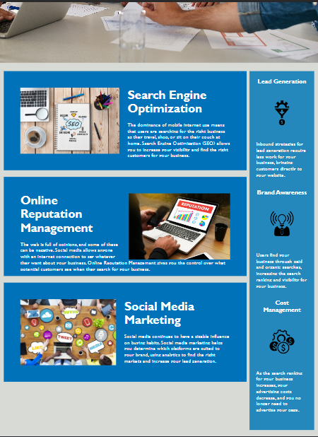

# SEO-for-Horiseon

## Challenge one of the UT Austin Fullstack coding bootcamp.

This website contains refactored aspects of the existing code to meet accessibility standards. The changes make it easier for people with disabilities to access to the website, and improves its position in search engines. The first link is now working, after adding an id tag. I also learned how to consolidate and comment the css file.

## Live Website

 https://emeraldregen.github.io/SEO-for-Horiseon/

## Installation

N/A

## Usage

To use this website, you can select any option from the navigation buttons at the top right corner. This will navigate you to the section of your choice. You can also scroll down to see the sections and other content.

## Credits

N/A

## License

Please refer to the LICENSE in the repo. 